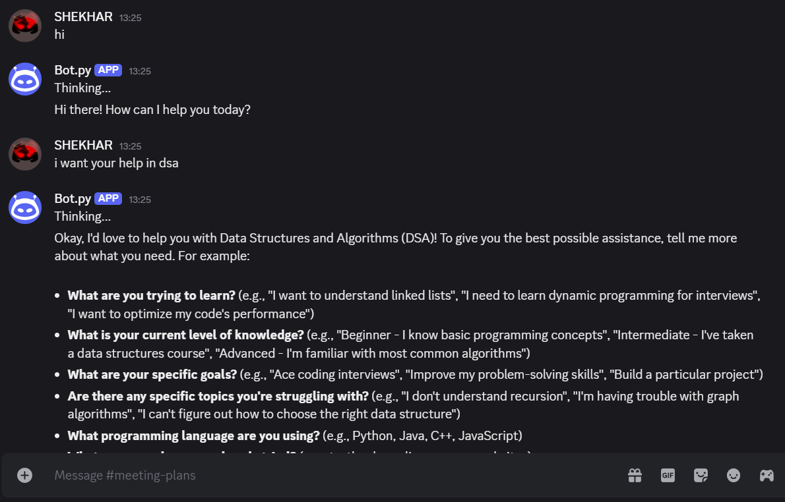
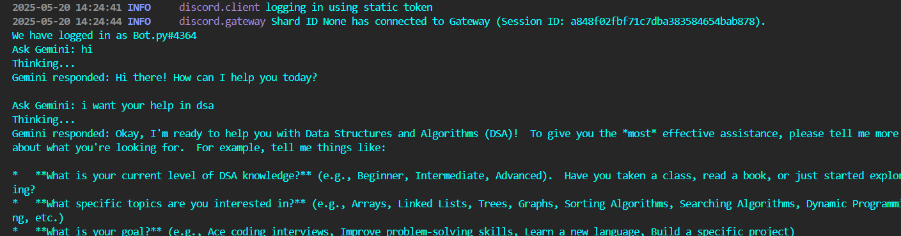

# 🤖 Discord Bot with Gemini API Integration

## Overview
This project is a powerful and customizable Discord bot built using Python. It integrates with the Gemini API to provide conversational AI features directly within Discord servers. The bot is designed for versatility and ease of use, making it a valuable addition to any server looking for smart automation, real-time interactions, and enhanced user engagement.

Additionally, the bot can be run and managed directly from the command line (CLI), enabling easy deployment and control.

## Features
- **Conversational AI Integration**: Utilizes the Gemini API for natural, context-aware interactions.
- **Commandless Input Support**: Users can chat naturally without needing command prefixes for certain actions.
- **Customizable Functionality**: Easily extend or modify features for tailored user experiences.
- **Modular Code Structure**: Commands and API interactions are organized for maintainability and scalability.
- **Environment Variable Management**: Secure storage of API keys and other sensitive information using `.env` files.
- **CLI Support**: Run and manage the bot directly from your command line interface.

## Preview

### Discord Chat Interaction


### CLI Bot Running (User Input/Output)


*(Replace the image paths with your actual screenshots)*

## Getting Started

1. **API Keys**:
    - Create a `.env` file in the root directory and add the following keys:
      ```
      DISCORD_TOKEN=your_discord_token
      GEMINI_API_KEY=your_gemini_api_key
      ```

2. **Install Required Libraries**:
    ```bash
    pip install discord.py requests google-generativeai python-dotenv
    ```

3. **Run the Bot** from the CLI:
    ```bash
    python bot.py
    ```

## Project Structure

- **bot.py**: Main entry point for the bot.
- **.env**: Holds API keys and configuration variables.
